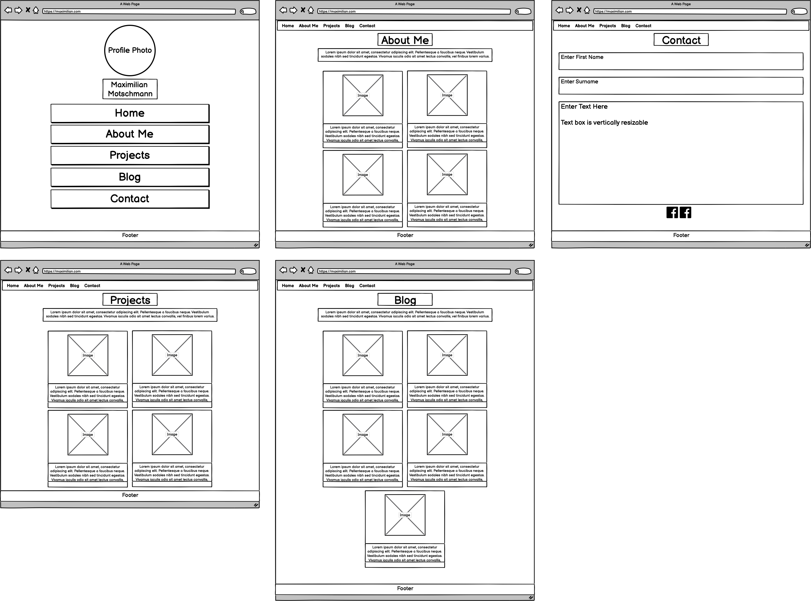
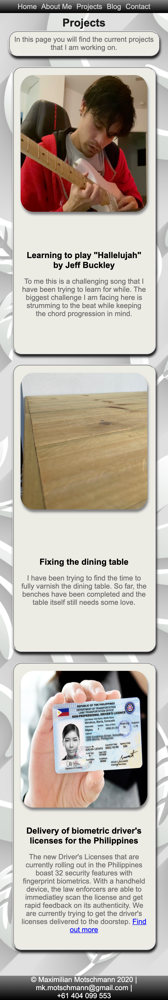
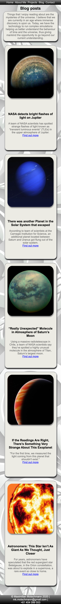

# Portfolio website by Maximilian K. Motschmann

#### URL: https://mkmotschmann.netlify.app

### Github repo: https://github.com/magikmaxx/MaximilianKellyMotschmann_T1A2/tree/main/MaximilianKellyMotschmann_T1A2

## Website details

### Purpose

The purpose of this website was to create a portfolio that would make me more accessible to future employers. The website currently demonstrates my basic skills that I am familiar with using HTML and CSS with the help of SCSS. Furthermore, the purpose is also to apply the knowledge that was taught in the past weeks during this course.

### Functionality/Features

The website functions on various screen sizes and is responsive to changes depending on screen size.

The website features a navigation bar on all pages. A home page with a profile photo, and buttons that will allow you to navigate to other pages within the website. The other pages also present are an About Me page, that allows people to find out more about myself. A Projects page where I showcase what I am currently working on. The website also features a Blog page where I have included five articles about recent discoveries within the universe. The last page that can be found within the website is the Contact page. The contact page allows the user to find my LinkedIn and GitHub page. Additionally, there is a form included that allows the user to fill in their details and add a message.
A footer has been included in all pages and the footer is locked to the bottom of every page.

#### Navigation bar

Home About Me Projects Blog Contact

The navigation bar will send you to each of these pages. Every page other than the index.html share a consistent layout.

### Target Audience

The target audience for this website is for future employers who may be interested in hiring junior developers. Another target audience are also people and businesses that wish to know more about myself.

### Tech Stack

For this website I used HTML and SCSS. The SCSS file was then automatically transpiled into CSS. The website was deployed multiple times via Netlify and the scripts were uploaded via GitHub.

### Sitemap

### Wireframes

## Mobile View

## Tablet View

## Desktop View

### Photo Credit

I have a freepik subscription where I can use any images without crediting such as the background image, other uncredited images have been done by myself. All other images can be found below.

#### About Me

Credit to Fender @ https://shop.fender.com/en-AU/start

Credit to Liverpool F.C. @ https://www.liverpoolfc.com/

Credit to Blizzard @ https://worldofwarcraft.com/en-gb/

#### Blog

Credit to Futurism @ https://futurism.com/nasa-detects-bright-flashes-of-light-on-jupiter

Credit to Futurism @ https://futurism.com/nasa-scientists-spot-unexpected-molecule-atmosphere-titan

https://futurism.com/evidence-another-planet-solar-system-escaped

Credit to NASA @ https://www.nasa.gov/

Credit to Futurism @ https://www.nasa.gov/

### Screenshots

## Mobile View

## Tablet View

## Desktop View

